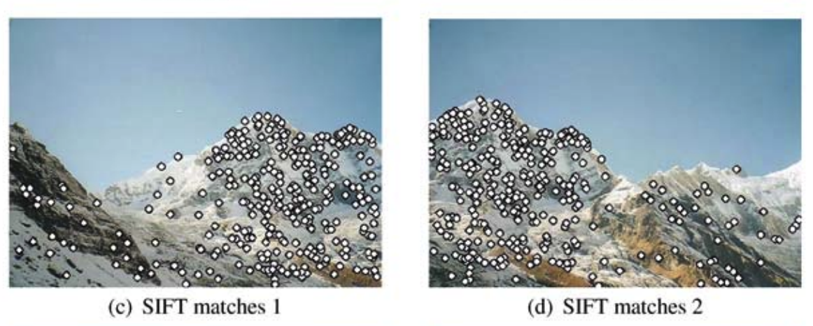

Members: Xinyou Ji(xinyouj), Zihe Zhao(zihezhao)

[Project URL](https://github.com/Ji-Xinyou/panoramic)
[Project Webpage URL](https://ji-xinyou.github.io/panoramic/)

---

[toc]

---

## [Milestone] - [Dec.3rd 2023]

### Future Schedule

### Current Progress

#### Preliminary Results

### Goals and Deliverables of the Proposal

### Plan for the Poster

### Concerned Issues

## [Proposal] - [Nov.15th 2023]

### Summary

We are going to parallelize panoramic image stitching, which is to stitch multiple pictures with overlapping fields to generate panoramic images, with different methods and provide performance benchmark.

### Background

  
  

Fig 1. Example of image stitching.

Figure 1[[^7]] shows the pipeline and an example of stitching images together. On a high level, we find feature key points in each image using SIFT. Then, we can use RANSAC to find the inliers. Then, we match features across neighboring images. Finally, we combine them based on the matched feature points. In the following subsections, we further discuss each step and how we plan to approach the parallelization.

#### Image acquisition

In this step, we simply collect a series of images with overlapping regions to be stitched together. This step is merely data acquisition and thus does not need parallel processing.

#### Identify feature

In this step, we identify feature key points in each image. Feature key points are the points (_e.g._ corners) that are invariant even if an image shifts or rotates. There are several methods for detecting feature key points. Some popular choices in the C++ OpenCV library[^1] are (ordered by year of publication):

-   **Harris Corner Detection**[[^2]] (`cv::cornerHarris`): a traditional approach published in 1988.
-   **Scale-Invariant Feature Transform (SIFT)**[[^3]] (`cv::xfeatures2d::SIFT`): a method robust to scale and rotation changes that is based on the local gradient around a key-point.
-   **Speeded-Up Robust Features (SURF)**[[^4]] (`cv::xfeatures2d::SURF`): an accelerated method akin to SIFT, leveraging integral images for better efficiency.
-   **Oriented FAST and Rotated BRIEF (ORB)**[[^5]] (`cv::ORB`): a method designed to have efficiency and good performance in real-time applications.

We will explore more and determine the one that fits most with our project. But according to the literatures **SIFT** is the most common choice.

In the implementation of this, we are required to find all the feature points for all pictures. Considering the scale of a picture and the independence of finding feature points, this could be heavily parallelized. For example, splitting the picture into subgrids and parallelize that is very interesting. Moreover, the load balance could be challenging as well.

#### Feature matching

Mentioned in the SIFT paper, we use the following method. For each pair of neighboring images, we use feature matching to determine if there is an overlapping region. Specifcally, we use feature descriptors to calculate the features gradient around each feature key point and then compare every pair of points across the two images. We mark the pairs of points with minimized Euclidean distances as the overlapping region. As stated above, matching features is also very parallelizable as well! Since each matching itself is independent.

There are also some tiny optimizations for this but since it is not related to parallelizing that, we are not mentioning them here.

#### Blend images

  

Fig 2. Example of homography transformation.

Homography involves a matrix transformation, as demonstrated in Figure 2, that can describe the projective (_e.g._ affine and rotation) translation from one set of points to another set of points. In our task, after finding the matching key points, we will need to find the homography matrix that can translate an image. To reduce the impact of falsely matched points, we use the Random Sample Consensus (RANSAC) [[^6]], an algorithm that finds the best homography transformation by:

1. Iteratively selecting subsets of corresponding points.
2. Estimating a homography for each subset.
3. Selecting the model with the highest inlier count.

We are able to parallelize this step through parallelizing the calculation for each different subset or the homography estimation step itself.

#### Multiple Image stitching

Above procedures are about stitching two images. When more images are required to be stitched, we can have more parallelism by stitching them in order. The order also affects the performance of the program. For example, if we have 4 images, we have two approaches. (1) stitch 1->2->3->4 (2) stitch 1->2, 3->4 and them stitch these two images. The second option allows to stitch two images in parallel.

### The Challenge

There are three major parts for parallelism, i.e. feature detection, feature matching and RANSAC homographiy matrix computing.

For the feature detection, we are essentially computing the feature points for each images. However, the distribution of feature points within the image is unknown. Hence if we are subgrid dividing the image or assign pixels to threads, we will certainly encounter workload imbalance problem. So one of the biggest challenges would be tackle this imbalanceness. We are looking for comparable performance compared to the opencv implementation. For the feature matching and RANSAC part, each computation has no dependency and can be fully-parallelized. Hence, the parallelism is more straightforward and the workload are more balanced.

There will be more workload imbalance if we expand the problem into stitching more than two images since each image pairs have inherently different magnitude of workload. We also hope that we can tackle this problem as well.

### Resources

We are planning to write the code from scratch.

For the machines, we are going to use GHC and PSC machines to test our performance of parallelization. We are going to use local machine/GHC machine for development and debugging.

There are many existing literatures for us to reference about the methodology of stitching images, which are already listed in this document. However, they are not about parallel implementation. Hence parallelizing them is still a challenging task for us to discover.

### Goals and Deliverables

#### Plan to achieve

We plan to achieve acceptable serial panoramic image creation. We plan to test this with real-life images. We also plan to parallelize this serial version using OpenMP and MPI. We plan to implement load balancing and subgrid dividing for parallelizing the feature detection phase. We plan to give speedup graph for different implementations.

#### Hope to achieve

We hope we can implement this in CUDA as well. We hope to further refine the image blending step such as adding color correction. We also hope to implement load balance in the RANSAC step. We hope we can get comparable performance to the OpenCV implementation.

#### Demo

We plan to show several examples panoramic images generated by us using real-life images. We also plan to show the speedup graph in the poster session. We hope that we can also bring our computer and run an interactive demo there by in-place running the program.

#### Capability

The system is capable of stitching multiple images into a panoramic image in parallel and fast. We hope the performance will be close to linear, but it depends on the serial portion of the program.

### Platform Choice

We plan to use C++ with parallelization achieved OpenMP, MPI and CUDA. We will be using the GHC machines for development and also PSC machine for benchmarking.

Rationale: C++ is native using parallel libararies. GHC machine is with GPU for us to try CUDA. PSC machine has many CPU cores for us to do more exhaustive benchmark.

### Schedule

| Date        | Week | Content                                                        |
| ----------- | ---- | -------------------------------------------------------------- |
| 11/16-11/23 | 1    | Implement sequential version and design parallelization.       |
| 11/24-12/04 | 2    | Implement parallelization of OpenMP and MPI. (Hopefully: CUDA) |
| 12/05-12/10 | 3    | Optimization(Load Balancing) and benchmark.                    |
| 12/11-12/15 | 4    | Writeup and presentation.                                      |

### References

[^1]: [OpenCV library](https://opencv.org/)
[^2]: Harris, C., & Stephens, M. (1988). A Combined Corner and Edge Detector. In _Proceedings of the Alvey Vision Conference_.
[^3]: Lowe, D. G. (2004). Distinctive Image Features from Scale-Invariant Keypoints. _International Journal of Computer Vision, 60_(2), 91–110.
[^4]: Bay, H., Ess, A., Tuytelaars, T., & Van Gool, L. (2008). Speeded-Up Robust Features (SURF). _Computer Vision and Image Understanding (CVIU), 110_(3), 346–359.
[^5]: Rublee, E., Rabaud, V., Konolige, K., & Bradski, G. (2011). ORB: An efficient alternative to SIFT or SURF. In _Proceedings of the IEEE International Conference on Computer Vision (ICCV)_.
[^6]: Fischler, M. A., & Bolles, R. C. (1981). Random Sample Consensus: A Paradigm for Model Fitting with Applications to Image Analysis and Automated Cartography. _Communications of the ACM (CACM), 24_(6), 381–395.
[^7]: Brown M, Lowe D G. Automatic panoramic image stitching using invariant features[J]. International journal of computer vision, 2007, 74: 59-73.
