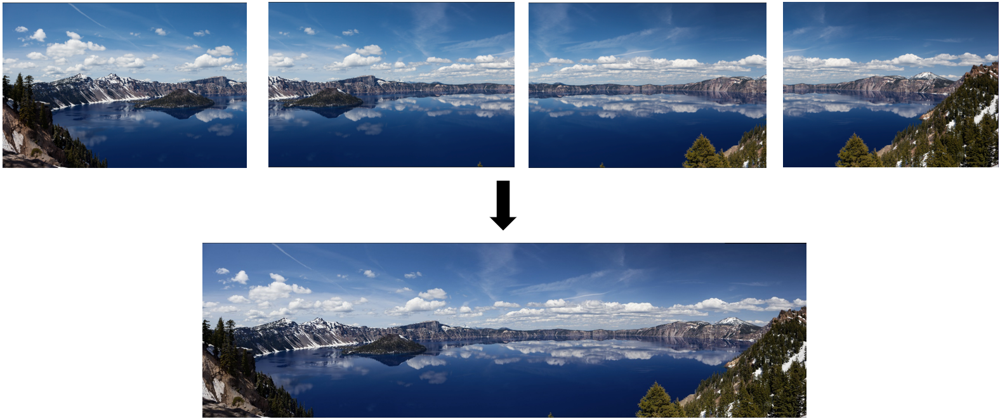

# Panoramic

Parallel Panoramic Image Stitching



- URL [Project Webpage URL](https://ji-xinyou.github.io/panoramic/)
- (MISC) To build on GHC machine: add this `export OpenCV_DIR="/usr/local/depot/fsl/fslpython/envs/fslpython/lib/cmake/opencv4"` to your bashrc
  - Moreover, some GHC machines do not have opencv4 installed, we know that ghc61, ghc30 (and maybe some others) have opencv4 installed
- (MISC) To run MPI normally on macOS, run `export TMPDIR=/tmp` to avoid unlink syscall failure.
  - Note that the MPI on macOS has unstable and degraded performance compared to Linux

## Build Requirements

- OpenCV, OpenMPI, OpenMP, CUDA, CMake, clang++
  - Minimal Supported Versions(MSV) of libraries are not tested, raise and issue if you meet any problems

## Example Run

! NOTE: opencv only supports two image stitching, our mpi/omp/cuda/seq supports any number of image stitching

```shell
> make build # build the project

# For sequential runs
> ./build/pano_cmd --detector seq --ransac seq --img ./data/viewL.png --img ./data/viewR.png

# For opencv runs
> ./build/pano_cmd --detector ocv --ransac ocv --img ./data/viewL.png --img ./data/viewR.png

# For mpi runs
> mpirun -n 8 ./build/pano_cmd --detector mpi --ransac mpi --img ./data/viewL.png --img ./data/viewR.png

# For openmp runs
> OMP_MAX_THREADS=8 ./build/pano_cmd --detector omp --ransac omp --img ./data/viewL.png --img ./data/viewR.png

# For cuda runs
> ./build/pano_cmd --detector cuda --ransac ocv --img ./data/viewL.png --img ./data/viewR.png

# For multiple images
> ./build/pano_cmd --detector cuda --ransac ocv --img ./data/v1.png --img ./data/v2.png --img ./data/v3.png --img ./data/v4.png
```

## Usage

> ./build/pano_cmd --help

```
Usage: Panoramic Image Stitcher [--help] [--version] --img VAR [--detector VAR] [--ransac VAR] [--harris-k VAR] [--harris-nms-thresh VAR] [--harris-nms-neigh VAR] [--harris-patch-size VAR] [--harris-max-ssd VAR] [--ransac-num-iter VAR] [--ransac-num-samples VAR] [--ransac-dist-thresh VAR]

Optional arguments:
  -h, --help            shows help message and exits 
  -v, --version         prints version information and exits 
  --img                 The images you want to stitch, from **left to right** [required]
  --detector            The type of feature detector and matcher to use: seq | ocv | mpi | cuda |... [nargs=0..1] [default: "seq"]
  --ransac              The type of RANSAC to use: seq | ocv | mpi | ... [nargs=0..1] [default: "seq"]
  --harris-k            The k parameter for Harris Corner Detector [nargs=0..1] [default: 0.03]
  --harris-nms-thresh   The threshold for non-maximum suppression [nargs=0..1] [default: 5000]
  --harris-nms-neigh    The neighborhood size for non-maximum suppression [nargs=0..1] [default: 3]
  --harris-patch-size   The patch size for Harris Corner Detector [nargs=0..1] [default: 5]
  --harris-max-ssd      The maximum SSD between two patches we are okay with [nargs=0..1] [default: 2500]
  --ransac-num-iter     The number of iterations for RANSAC [nargs=0..1] [default: 1000]
  --ransac-num-samples  The number of samples for each RANSAC iteration [nargs=0..1] [default: 4]
  --ransac-dist-thresh  The distance threshold for a point to be considered an inlier [nargs=0..1] [default: 5]
```
